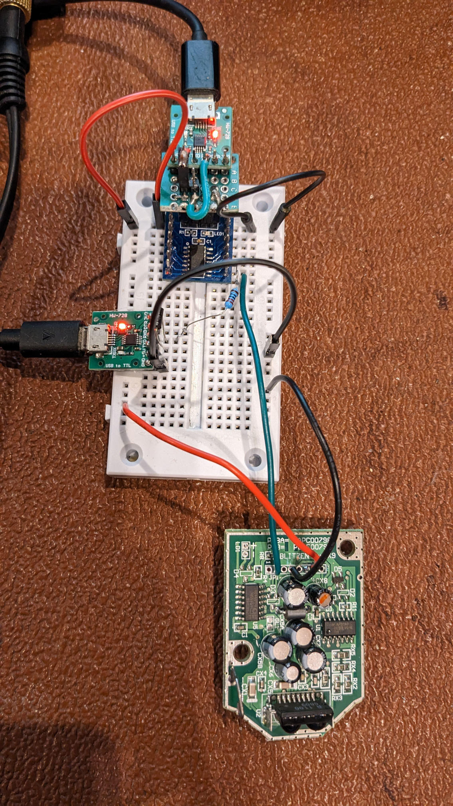

# hp82240b
Emulate this vintage IR printer, used with Hewlett Packard calculators.
Currently text-only, and tested with HP-17BII.

IR receiver extracted from [HP C4013A](http://www.colin99.co.uk/extras/irda/hp_c4103a_irda.htm), and connected with an ATTINY1614.



Connect TX of ATTINY1614 via USB/Serial adapter, then run:
```
minicom -b 115200 -8 -R utf-8 -D /dev/ttyUSB1
```

